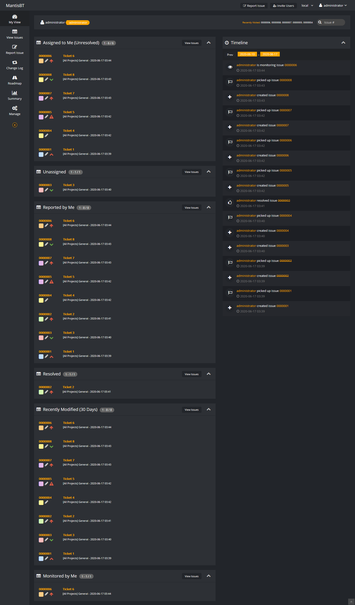

# Mantis Bugtracker Modern Dark Theme



## About

I wanted a modern clean and dark theme for MantisBT. 

Based on https://github.com/iKyzu/MantisBTModernDarkTheme

Edited from https://github.com/polnetwork/MantisBTModernTheme

## Installation

Upload the whole folder into your `plugins/` folder in the mantis installation so that you e.g. have `MANTIS_INSTALLATION/plugins/MantisBTModernDarkTheme/MantisBTModernDarkTheme.php`. After that the plugin should show up on the `manage_plugin_page.php` page in the mantis settings. There you can simply install it to activate it.

I recommend you to set this colors inside your config/config_inc.php file

```php
$g_status_colors = array( 'new.sh' => '#ffa0a0', # red,
    'feedback' => '#ff50a8', # purple
    'acknowledged' => '#ffd850', # orange
    'confirmed' => '#ffffb0', # yellow
    'assigned' => '#c8c8ff', # blue
    'resolved' => '#cceedd', # buish-green
    'closed' => '#e8e8e8'); # light gray
```

Each user can then enable the dark theme in Account -> Preferences

## Core patch (required for flash-free dark mode)

This plugin uses `EVENT_LAYOUT_HEAD_BEGIN` — a custom event that does not exist in vanilla Mantis core. It fires at the very start of `<head>`, before any CSS is loaded, and allows the plugin to inject an inline blocking script that immediately applies the dark mode class to `<html>`. This eliminates the white flash when the page loads.

Apply the patch from `imatic-update/dark_theme_head_begin_event.patch` to Mantis core:

```bash
git apply imatic-update/dark_theme_head_begin_event.patch
```

The patch adds:
- `EVENT_LAYOUT_HEAD_BEGIN` declaration in `core/events_inc.php`
- `event_signal('EVENT_LAYOUT_HEAD_BEGIN')` at the top of `layout_page_header_begin()` in `core/layout_api.php`

**Without the patch**, the plugin falls back to loading CSS at the end of `<body>` via `EVENT_LAYOUT_BODY_END`. The dark theme will still work but users will see a white flash on every page load before the dark styles are applied.

To use without the patch, change the hooks in `ImaticMantisDarkTheme.php`:

```php
function hooks()
{
    return array(
        'EVENT_ACCOUNT_PREF_UPDATE_FORM' => 'account_update_form',
        'EVENT_ACCOUNT_PREF_UPDATE' => 'account_update',
        'EVENT_LAYOUT_BODY_END' => 'layout_body_end_hook',  // CSS + JS here
    );
}
```

and move the dark mode CSS `<link>` tags back into `layout_body_end_hook`.
